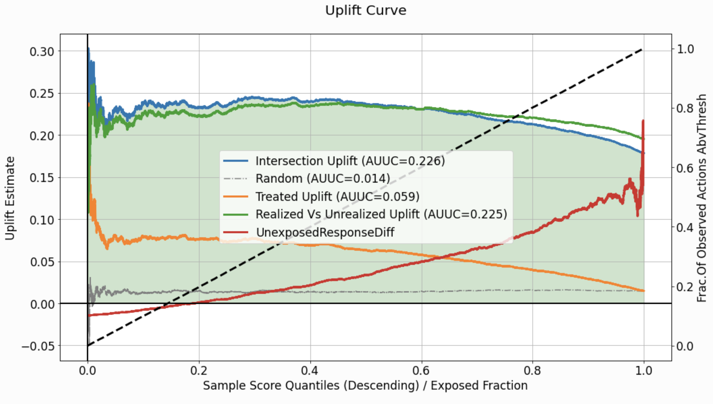

[comment]: <> (Modify also docs/installation.rst if change the README.md)

[comment]: <> (Modify also LICENSE.rst if change the README.md)

uplift-analysis
================

[comment]: <> (Modify also docs/badges.rst if you change the badges)

[comment]: <> (Modify also LICENSE.rst if you change the license)


**uplift-analysis** is a ``Python`` library that contains implementations of methods and utilities, which can serve use
cases requiring the analysis of uplift modeling techniques.<br/>
The implemented modules include scoring utilities, analysis strategy, and relevant visualization methods.

This library works for Python 3.7 and higher.

Installation
------------
This library is distributed on [PyPi](missing_url) and can be installed using ``pip``.
<span style="color:red">Still need to take care of this</span>.

~~~~~~~~~~~~~~~~~~~~~~~~~~~~~~
$ pip install uplift-analysis 
~~~~~~~~~~~~~~~~~~~~~~~~~~~~~~

The command above will automatically install all the required dependencies. Please visit the
[installation](needs_to_be_fixed) page for more details.

<span style="color:red">Still need to take care of this</span>.


Getting started
---------------
Check out the comprehensive [tutorial](broken_link) for a complete walk-through of the library.
<span style="color:red">Still need to take care of this</span>.

```python
import pandas as pd
from uplift_analysis import data, evaluation

eval_set = data.EvalSet(df=pd.DataFrame({
    'observed_action': treatments,
    'responses': responses,
    'score': scores,
    'proposed_action': recommended_treatments
}))

evaluator = evaluation.Evaluator()
eval_res, summary = evaluator.eval_and_show(eval_set, specify=['uplift'],
                                            show_random=True, num_random_rep=4)
```



Documentation
-------------
For more information, refer to our
[blogpost](broken_link),
[complete documentation](broken_link), and [tutorial](broken_link).


Info for developers
-------------------

The source code of the project is available on [GitHub](https://github.com/PlaytikaResearch/uplift-analysis).

~~~~~~~~~~~~~~~~~~~~~~~~~~~~~~~~~~~~~~~~~~~~~~~~~~~~~~~~~~~~~~~~~~~
$ git clone https://github.com/PlaytikaResearch/uplift-analysis.git
~~~~~~~~~~~~~~~~~~~~~~~~~~~~~~~~~~~~~~~~~~~~~~~~~~~~~~~~~~~~~~~~~~~

You can install the library and the dependencies with one of the following commands:

~~~~~~~~~~~~~~~~~~~~~~~~~~~~~~~~~~~~~~~~~~~~~~~~~~~~~~~~~~~~~~~~~~~~~~~~~~~~~~~~~~~~~~~~~~~~~~~~
$ pip install .                        # install library + dependencies
$ pip install ".[develop]"             # install library + dependencies + developer-dependencies
$ pip install -r requirements.txt      # install dependencies
$ pip install -r requirements-dev.txt  # install developer-dependencies
~~~~~~~~~~~~~~~~~~~~~~~~~~~~~~~~~~~~~~~~~~~~~~~~~~~~~~~~~~~~~~~~~~~~~~~~~~~~~~~~~~~~~~~~~~~~~~~~

To create the file ``*.whl`` for the installation with ``pip`` run the following command (at the root of the
repository):

~~~~~~~~~~~~~~~~~~~~~~~~~~~~~~~~~~~
$ python -m build
~~~~~~~~~~~~~~~~~~~~~~~~~~~~~~~~~~~

To create the HTML documentation run the following commands:

~~~~~~~~~~~~~~~~~~~~~~~~~~~~~~~~~~~~~~~
$ cd docs
$ make clean
$ make html
~~~~~~~~~~~~~~~~~~~~~~~~~~~~~~~~~~~~~~~

Run tests
---------

Tests can be executed with ``pytest`` running the following commands:

~~~~~~~~~~~~~~~~~~~~~~~~~~~~~~~~~~~~~~~~~~~~~~~~~~~~~~~~~~~~~~~~~~~~~~~~~~~~~~
$ cd tests
$ pytest                                      # run all tests
$ pytest test_testmodule.py                   # run all tests within a module
$ pytest test_testmodule.py -k test_testname  # run only 1 test
~~~~~~~~~~~~~~~~~~~~~~~~~~~~~~~~~~~~~~~~~~~~~~~~~~~~~~~~~~~~~~~~~~~~~~~~~~~~~~

License
-------

[MIT License](LICENSE)
